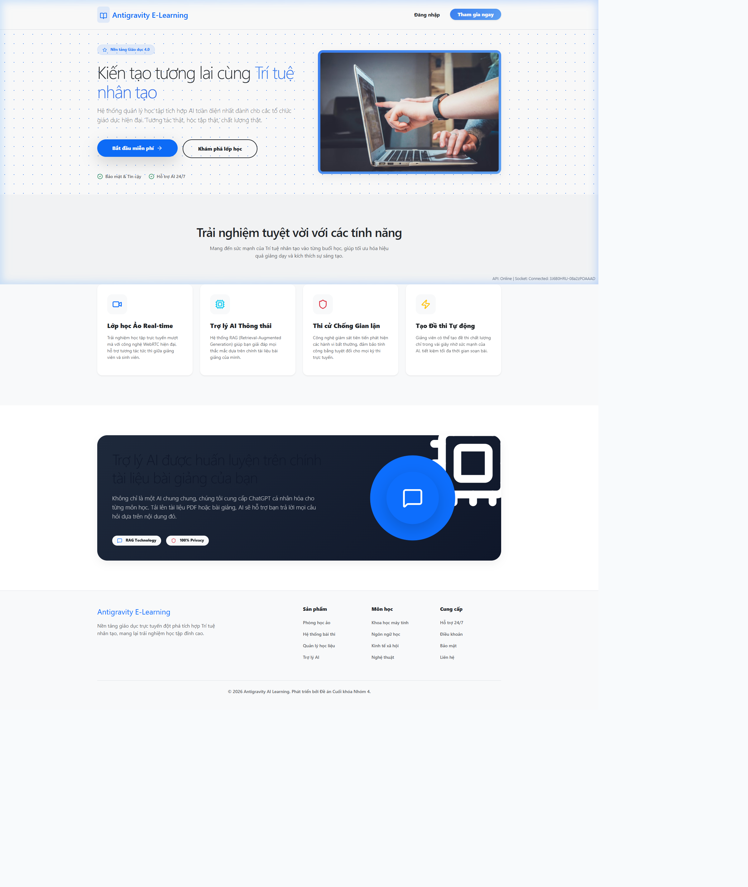

## Online Learning & Real-time Exam System with Local AI Tutor



### 1. Introduction

This project focuses on building an **All-in-one online learning platform** that combines real-time virtual classrooms with a strict online examination system. The key highlight is the integration of a **self-hosted AI Tutor** using Retrieval-Augmented Generation (RAG), capable of understanding teaching materials instantly and assisting lecturers during live classes. The system is designed to run efficiently on limited hardware such as personal laptops or small servers.

### 2. Objectives

* Build a real-time virtual classroom similar to Google Meet
* Integrate a secure online exam system with basic anti-cheating mechanisms
* Deploy a local AI Tutor that can read and answer questions from learning materials
* Ensure full data privacy with no external AI APIs

### 3. Technology Stack

* **Frontend**: ReactJS (Vite), Socket.io-client, Simple-Peer (WebRTC)
* **Backend**: Node.js, ExpressJS
* **Database**: MongoDB
* **AI Engine**:
  * Runtime: Ollama (Local)
  * Model: Qwen-2.5-1.5B (or similar)
  * Orchestration: LangChain.js
* **Architecture**: Monolithic Modular
* **Containerization**: Docker & Docker Compose

### 4. System Modules

#### 4.1 Virtual Classroom

* WebRTC P2P video conferencing (Mesh architecture)
* Real-time chat using Socket.io
* Hand raise and screen sharing

#### 4.2 AI Tutor (Self-hosted RAG)

* Lecturer uploads PDF/Slide materials
* AI processes and understands documents locally
* Students ask questions and receive contextual answers
* No data leaves the internal system

#### 4.3 Online Exam & Monitoring

* Multiple choice and essay exams
* Server-side countdown timer
* Detect tab switching, focus loss, copy/paste
* Auto-submit when violations exceed limit

### 5. AI Algorithm (RAG Pipeline)

1. **Text Splitting**: Recursive Character Text Splitting
2. **Embedding**: nomic-embed-text
3. **Vector Search**: HNSW index (MongoDB Atlas / in-memory lookup)
4. **Similarity Matching**: Cosine Similarity
5. **Answer Generation**: Transformer-based Qwen model

### 6. Practical Significance

* Zero cost for external AI APIs
* Full data privacy for exams and teaching materials
* Optimized performance with client-side video and local AI processing

### 7. Team Roles

* Backend Engineer
* Frontend Engineer
* AI Engineer
* Leader / Database / Admin

---

### 8. Installation & Setup

#### Prerequisites
* **Node.js**: v18 or later
* **MongoDB**: Local or Atlas instance
* **Ollama**: Installed locally or via Docker
* **Docker & Docker Compose** (Optional, for containerized run)

#### Environment Variables
Create a `.env` file in both `backend` and `frontend` folders:

**Backend (`backend/.env`)**
```env
PORT=5000
MONGO_URI=mongodb://localhost:27017/online-learning-ai
JWT_SECRET=your_jwt_strong_secret
OLLAMA_URL=http://localhost:11434
```

**Frontend (`frontend/.env`)**
```env
VITE_API_URL=http://localhost:5000
```

#### Running Locally (Manual)
1. **Start Ollama** and download the model:
   ```bash
   ollama run qwen:0.5b
   ollama pull nomic-embed-text
   ```

2. **Start the Backend**:
   ```bash
   cd backend
   npm install
   npm run dev
   ```

3. **Start the Frontend**:
   ```bash
   cd frontend
   npm install
   npm run dev
   ```

#### Running with Docker (Recommended)
You can spin up the entire stack using Docker Compose:
```bash
docker-compose up --build
```
This will start the frontend, backend, MongoDB, and Ollama in isolated containers.

---

## Hệ thống Học trực tuyến & Thi thời gian thực với Gia sư AI cục bộ


### 1. Giới thiệu

Dự án này tập trung xây dựng một **Nền tảng học trực tuyến tất cả trong một**, kết hợp các lớp học ảo thời gian thực với hệ thống thi trực tuyến nghiêm ngặt. Điểm nổi bật chính là sự tích hợp của **Gia sư AI tự host** sử dụng kỹ thuật RAG (Retrieval-Augmented Generation), có khả năng hiểu tài liệu giảng dạy ngay lập tức và hỗ trợ giảng viên trong các lớp học trực tiếp. Hệ thống được thiết kế để chạy hiệu quả trên phần cứng hạn chế như laptop cá nhân hoặc server nhỏ.

### 2. Mục tiêu

*   Xây dựng lớp học ảo thời gian thực tương tự Google Meet
*   Tích hợp hệ thống thi trực tuyến an toàn với cơ chế chống gian lận cơ bản
*   Triển khai Gia sư AI cục bộ có thể đọc và trả lời câu hỏi từ tài liệu học tập
*   Đảm bảo bảo mật dữ liệu tuyệt đối, không sử dụng API AI bên ngoài

### 3. Công nghệ sử dụng

*   **Frontend**: ReactJS (Vite), Socket.io-client, Simple-Peer (WebRTC)
*   **Backend**: Node.js, ExpressJS
*   **Database**: MongoDB
*   **AI Engine**:
    *   Runtime: Ollama (Local)
    *   Model: Qwen-2.5-1.5B (hoặc tương tự)
    *   Orchestration: LangChain.js
*   **Kiến trúc**: Monolithic Modular
*   **Ảo hoá**: Docker & Docker Compose

### 4. Các phân hệ hệ thống

#### 4.1 Lớp học ảo (Virtual Classroom)

*   Hội nghị video P2P WebRTC (Kiến trúc Mesh)
*   Chat thời gian thực sử dụng Socket.io
*   Giơ tay phát biểu và chia sẻ màn hình

#### 4.2 Gia sư AI (RAG tự host)

*   Giảng viên tải lên tài liệu PDF/Slide
*   AI xử lý và hiểu tài liệu cục bộ
*   Sinh viên đặt câu hỏi và nhận câu trả lời theo ngữ cảnh
*   Không có dữ liệu nào rời khỏi hệ thống nội bộ

#### 4.3 Thi trực tuyến & Giám sát

*   Đề thi trắc nghiệm và tự luận
*   Bộ đếm ngược phía server
*   Phát hiện chuyển tab, mất focus, copy/paste
*   Tự động nộp bài khi vi phạm vượt quá giới hạn

### 5. Thuật toán AI (RAG Pipeline)

1.  **Cắt nhỏ văn bản (Text Splitting)**: Recursive Character Text Splitting
2.  **Mã hóa (Embedding)**: nomic-embed-text
3.  **Tìm kiếm Vector (Vector Search)**: HNSW index
4.  **Khớp tương đồng (Similarity Matching)**: Cosine Similarity
5.  **Sinh câu trả lời (Answer Generation)**: Mô hình Qwen dựa trên Transformer

### 6. Ý nghĩa thực tiễn

*   Không tốn chi phí cho API AI bên ngoài
*   Bảo mật dữ liệu tuyệt đối cho đề thi và tài liệu giảng dạy
*   Tối ưu hóa hiệu năng với video client-side và xử lý AI cục bộ

### 7. Vai trò nhóm

*   Backend Engineer
*   Frontend Engineer
*   AI Engineer
*   Leader / Database / Admin

---

### 8. Cài đặt và Khởi chạy

#### Yêu cầu
* **Node.js**: v18 hoặc mới hơn
* **MongoDB**: Cài đặt Local hoặc sử dụng Atlas
* **Ollama**: Cài đặt Local hoặc sử dụng qua Docker
* **Docker & Docker Compose** (Tuỳ chọn cho chạy ảo hoá)

#### Cấu hình biến môi trường
Tạo file `.env` ở cả thư mục `backend` và `frontend`:

**Backend (`backend/.env`)**
```env
PORT=5000
MONGO_URI=mongodb://localhost:27017/online-learning-ai
JWT_SECRET=your_jwt_strong_secret
OLLAMA_URL=http://localhost:11434
```

**Frontend (`frontend/.env`)**
```env
VITE_API_URL=http://localhost:5000
```

#### Chạy dự án (Local/Thủ công)
1. **Khởi động Ollama** và tải model:
   ```bash
   ollama run qwen:0.5b
   ollama pull nomic-embed-text
   ```

2. **Khởi động Backend**:
   ```bash
   cd backend
   npm install
   npm run dev
   ```

3. **Khởi động Frontend**:
   ```bash
   cd frontend
   npm install
   npm run dev
   ```

#### Chạy dự án (Docker)
Sử dụng cấu hình Docker Compose để khởi chạy toàn bộ dịch vụ:
```bash
docker-compose up --build
```
Lệnh này sẽ tự động tải các images cần thiết và cấu hình network kết nối cho Frontend, Backend, MongoDB và Ollama.