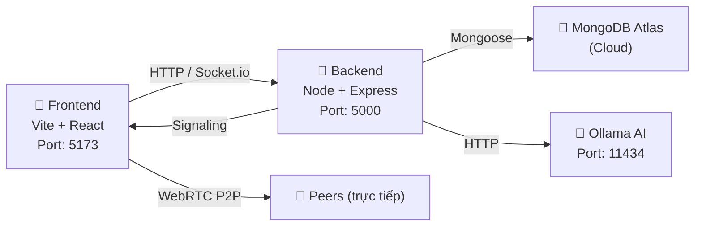

# 🔍 Phân tích Đồ án — Online Learning AI

## 📊 Tổng quan kiến trúc hiện tại



---

## ✅ Những gì đã có (Đã triển khai)

| Thành phần | Trạng thái | Ghi chú |
|---|---|---|
| **Auth** (Register/Login/JWT) | ✅ Hoàn chỉnh | bcrypt + JWT 24h |
| **Database** (MongoDB Atlas) | ✅ Đang kết nối | Atlas cloud, không cần cài local |
| **Models** | ✅ Có đủ | User, Classroom, Exam, Material, Message, Result |
| **Frontend Routing** | ✅ Hoạt động | React Router, phân quyền role |
| **Video Meeting** (WebRTC) | ✅ Vừa làm | Simple-peer + Socket.io Signaling |
| **Chat** (Socket.io) | ✅ Cơ bản | classroomSocket |
| **Anti-cheat** (ExamRoom) | ✅ Cơ bản | Detect tab switch, fullscreen |
| **Docker Compose** | ✅ Có sẵn | Chưa đầy đủ cho production |
| **Ollama AI** | ⚠️ Chưa dùng được | Config có nhưng chưa tích hợp đầy đủ |
| **API Backend** | ⚠️ Thiếu nhiều | Mới chỉ có `/api/auth` |

---

## 🖥️ CHẠY LOCAL — Cần chuẩn bị gì?

### 1. Yêu cầu phần mềm

| Phần mềm | Version | Link |
|---|---|---|
| **Node.js** | v20+ | [nodejs.org](https://nodejs.org) |
| **npm** | v9+ | Đi kèm Node.js |
| **Git** | Bất kỳ | [git-scm.com](https://git-scm.com) |
| **Ollama** *(nếu dùng AI)* | Latest | [ollama.com](https://ollama.com) |

> [!NOTE]
> **MongoDB**: Dự án đang dùng **MongoDB Atlas** (cloud), không cần cài MongoDB local. Chỉ cần đảm bảo có internet.

### 2. Các bước chạy local

```bash
# 1. Clone project
git clone <repo-url>
cd Online-learning-ai

# 2. Tạo file .env ở thư mục gốc (đã có sẵn, kiểm tra lại)
# Xác nhận MONGO_URI, JWT_SECRET đúng

# 3. Cài dependencies Backend
cd backend && npm install && cd ..

# 4. Cài dependencies Frontend  
cd frontend && npm install && cd ..

# 5. Chạy Backend (Terminal 1)
cd backend && npm run dev
# → Chạy trên http://localhost:5000

# 6. Chạy Frontend (Terminal 2)
cd frontend && npm run dev
# → Chạy trên http://localhost:5173
```

### 3. ⚠️ Vấn đề hiện tại cần sửa trước khi test

| Vấn đề | Nguyên nhân | Cách sửa |
|---|---|---|
| `simple-peer` lỗi với Vite | CJS compatibility | ✅ Đã sửa `vite.config.js` |
| `process is not defined` | simple-peer cần Node globals | ✅ Đã sửa `global: 'globalThis'` |
| URL Backend hardcode `localhost:5000` | Chưa dùng env var | Cần thay bằng `import.meta.env.VITE_API_URL` |
| `JWT_SECRET` quá đơn giản | `supersecretkey` | Sửa trước khi deploy |

---

## 🚀 DEPLOY LÊN SERVER THẬT — Checklist đầy đủ

### Giai đoạn 1: Chuẩn bị môi trường Server

```
□ Thuê VPS (khuyên: DigitalOcean/Hetzner $6-10/tháng, hoặc Render.com free tier)
□ Cài Docker + Docker Compose trên VPS
□ Cài Nginx (reverse proxy)
□ Mua tên miền (hoặc dùng IP tạm)
□ Cấu hình SSL (Let's Encrypt — miễn phí)
```

### Giai đoạn 2: Sửa code cho production

```
□ Thay toàn bộ "http://localhost:5000" → dùng VITE_API_URL env var
□ Đổi JWT_SECRET thành chuỗi random dài 64 ký tự
□ Backend Dockerfile: đổi CMD từ "npm run dev" → "npm start"
□ Thêm Dockerfile cho Frontend (build static + Nginx serve)
□ Sửa docker-compose.yml cho production
□ Thêm TURN server config vào useMeeting.js (cho WebRTC qua internet)
```

### Giai đoạn 3: Dịch vụ bên ngoài cần đăng ký

| Dịch vụ | Mục đích | Chi phí | Link |
|---|---|---|---|
| **MongoDB Atlas** | Database | ✅ Free (đã có) | Đang dùng |
| **Metered.ca** | TURN server (WebRTC) | Free 500GB/tháng | [metered.ca](https://metered.ca) |
| **VPS/Cloud** | Host backend | $6-10/tháng | DigitalOcean, Hetzner |
| **Vercel/Netlify** | Host frontend | ✅ Free | Khuyên dùng |
| **Render.com** | Host backend | Free (sleep 15p) | [render.com](https://render.com) |

> [!IMPORTANT]
> **WebRTC qua Internet = BẮT BUỘC có TURN server**. Khi 2 máy tính không cùng mạng LAN, WebRTC cần TURN server để relay video/audio. Không có TURN = video call không kết nối được.

### Giai đoạn 4: Kiến trúc production đề xuất

```
Internet
   │
   ▼
[Cloudflare DNS + CDN]
   │
   ├──► [Vercel] ── Frontend (React build static)
   │
   └──► [VPS - Nginx]
           ├── /api/*  → Backend Node.js (port 5000)
           ├── /socket.io → Socket.io
           └── SSL termination (Let's Encrypt)

Database: MongoDB Atlas (đã có)
AI Model: Ollama trên VPS (nếu có RAM đủ) hoặc bỏ qua
```

---

## 📋 Danh sách API còn thiếu (cần code trước khi demo)

Hiện tại backend chỉ có `authRoutes.js`. Cần bổ sung:

| API | Priority | Người làm |
|---|---|---|
| `GET/POST /api/classrooms` | 🔴 Cao | Backend Dev |
| `POST /api/classrooms/:id/join` | 🔴 Cao | Backend Dev |
| `GET/POST /api/exams` | 🔴 Cao | Backend Dev |
| `POST /api/exams/:id/submit` | 🔴 Cao | Backend Dev |
| `POST /api/materials/upload` | 🟡 Trung bình | Backend Dev |
| `POST /api/chat/ask-ai` | 🟡 Trung bình | AI Dev |
| `GET /api/users` (Admin) | 🟢 Thấp | Backend Dev |

---

## 🎯 Kế hoạch hành động đề xuất

```
Tuần này (local):
  ✅ Đã có: Auth, Video Meeting, Anti-cheat UI
  → Cần làm: API Classroom + Exam (backend)
  → Cần làm: Kết nối frontend với real API

Trước khi demo:
  → Fix hardcode URL (dùng env var)
  → Test video meeting với 4 người cùng mạng WiFi

Khi deploy:
  → Đăng ký Metered.ca TURN server (5 phút)
  → Deploy backend lên Render.com (free)
  → Deploy frontend lên Vercel (free)
  → Test lại video meeting qua internet
```
