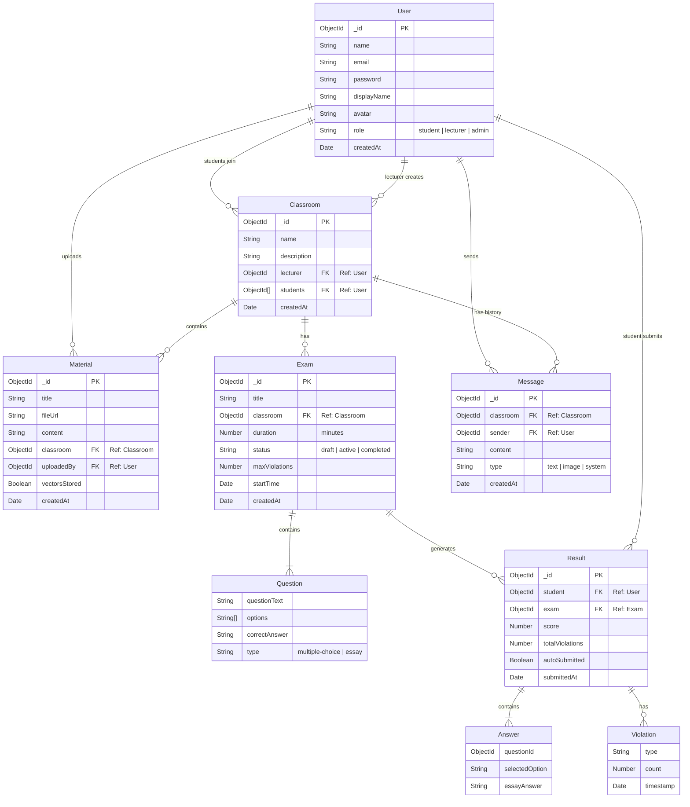

# Entity Relationship Diagram (ERD)

```mermaid
erDiagram
    User {
        ObjectId _id PK
        String name
        String email
        String password
        String displayName
        String avatar
        String role "student | lecturer | admin"
        Date createdAt
    }

    Classroom {
        ObjectId _id PK
        String name
        String description
        ObjectId lecturer FK "Ref: User"
        ObjectId[] students FK "Ref: User"
        Date createdAt
    }

    Material {
        ObjectId _id PK
        String title
        String fileUrl
        String content
        ObjectId classroom FK "Ref: Classroom"
        ObjectId uploadedBy FK "Ref: User"
        Boolean vectorsStored
        Date createdAt
    }

    Exam {
        ObjectId _id PK
        String title
        ObjectId classroom FK "Ref: Classroom"
        Number duration "minutes"
        String status "draft | active | completed"
        Number maxViolations
        Date startTime
        Date createdAt
    }

    Question {
        String questionText
        String[] options
        String correctAnswer
        String type "multiple-choice | essay"
    }

    Result {
        ObjectId _id PK
        ObjectId student FK "Ref: User"
        ObjectId exam FK "Ref: Exam"
        Number score
        Number totalViolations
        Boolean autoSubmitted
        Date submittedAt
    }

    Answer {
        ObjectId questionId
        String selectedOption
        String essayAnswer
    }

    Violation {
        String type
        Number count
        Date timestamp
    }

    Message {
        ObjectId _id PK
        ObjectId classroom FK "Ref: Classroom"
        ObjectId sender FK "Ref: User"
        String content
        String type "text | image | system"
        Date createdAt
    }

    %% Relationships
    User ||--o{ Classroom : "lecturer creates"
    User ||--o{ Classroom : "students join"
    Classroom ||--o{ Material : "contains"
    User ||--o{ Material : "uploads"
    Classroom ||--o{ Exam : "has"
    Exam ||--|{ Question : "contains"
    User ||--o{ Result : "student submits"
    Exam ||--o{ Result : "generates"
    Result ||--|{ Answer : "contains"
    Result ||--o{ Violation : "has"
    Classroom ||--o{ Message : "has history"
    User ||--o{ Message : "sends"

```
