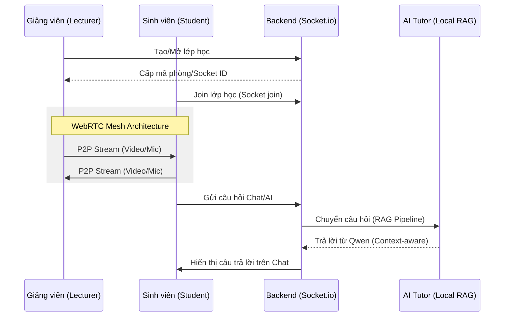
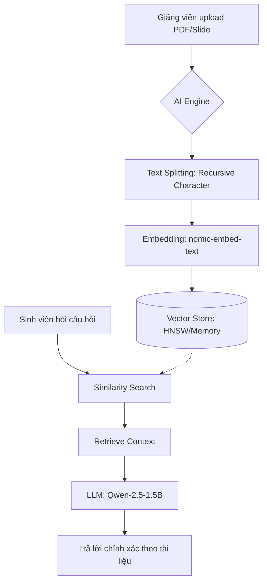
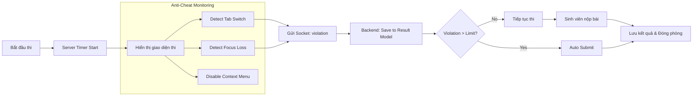

# 🔄 SYSTEM WORKFLOWS

This document visualizes the core processes of the **Online Learning & AI Tutor** system.

---

## 1. 🎓 Learning & Virtual Classroom Flow
Mô tả quy trình giảng viên mở lớp, sinh viên tham gia và tương tác.

---

## 2. 🤖 AI Tutor RAG Pipeline
Quy trình xử lý tài liệu nội bộ (Local) không cần API bên ngoài.

---

## 3. 📝 Secure Exam Flow
Quy trình thi trực tuyến với các cơ chế chống gian lận (Anti-cheat).

---

## 4. 📂 Data Relationship (Quick View)
- **User** sở hữu **Classroom**.
- **Classroom** chứa nhiều **Material** & **Exam**.
- **Exam** sinh ra nhiều **Result** (gồm Score & List Violations).
