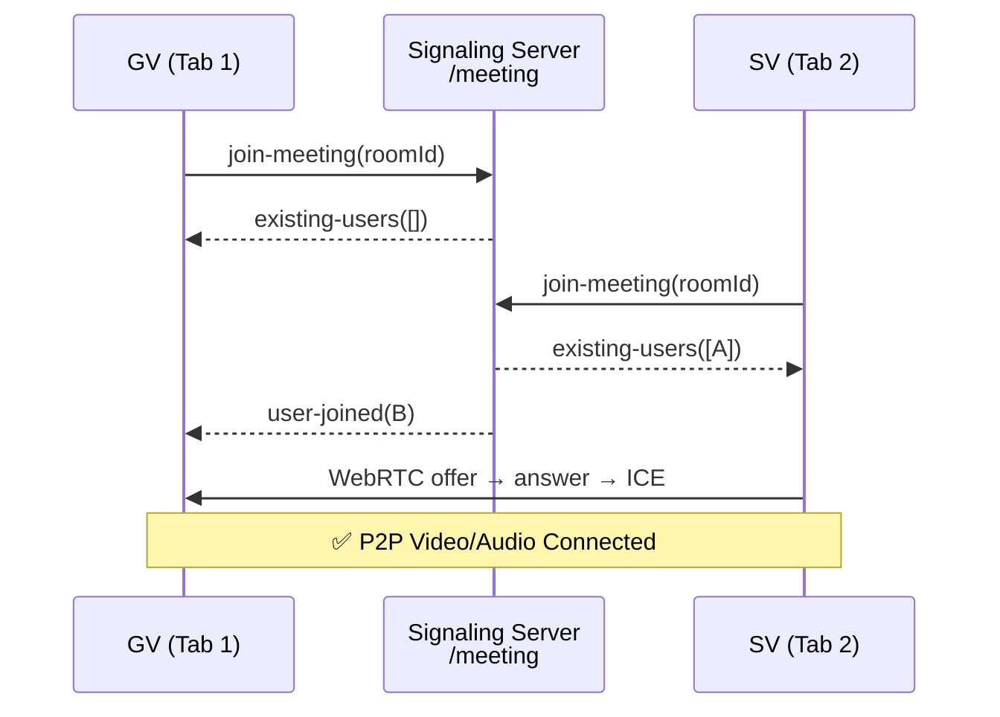

# ✅ Walkthrough: Video Meeting (Google Meet Style)

## Những gì đã triển khai

### Backend
| File | Thay đổi |
|---|---|
| [backend/src/socket/meetingSocket.js](file:///f:/Online-learning-ai/backend/src/socket/meetingSocket.js) | **[MỚI]** Signaling server WebRTC (namespace `/meeting`) |
| [backend/index.js](file:///f:/Online-learning-ai/backend/index.js) | Đăng ký `meetingSocket` |

### Frontend
| File | Thay đổi |
|---|---|
| [frontend/src/hooks/useMeeting.js](file:///f:/Online-learning-ai/frontend/src/hooks/useMeeting.js) | **[MỚI]** Hook WebRTC: tạo/quản lý SimplePeer cho từng peer |
| [frontend/src/features/student/VirtualClassroom.jsx](file:///f:/Online-learning-ai/frontend/src/features/student/VirtualClassroom.jsx) | **[VIẾT LẠI]** Google Meet-style UI hoàn chỉnh |
| [frontend/vite.config.js](file:///f:/Online-learning-ai/frontend/vite.config.js) | Fix `simple-peer` + Vite CJS compatibility |

---

## Luồng hoạt động

---

## Hướng dẫn test LOCAL

**Yêu cầu**: Backend và Frontend đang chạy.

1. **Mở Tab 1** → Đăng nhập → vào `/virtual-classroom/phong-hoc-01`
2. **Mở Tab 2** (Incognito) → Đăng nhập tài khoản khác → vào `/virtual-classroom/phong-hoc-01`
3. ✅ Cả 2 tab thấy video của nhau
4. Bật/tắt Mic, Camera → tab kia cập nhật icon trạng thái
5. Bấm Share Screen → tab kia thấy màn hình đang chia sẻ
6. Bấm "Rời phòng" → tab kia ẩn video

---

## Lưu ý khi Deploy lên Cloud

> **Cần TURN server** khi deploy ra internet (do NAT traversal):
> - **Miễn phí**: [Metered.ca](https://metered.ca) (500GB/tháng free)
> - **Tự host**: Coturn trên VPS
>
> Sau khi có TURN credentials, uncomment config trong [useMeeting.js](file:///f:/Online-learning-ai/frontend/src/hooks/useMeeting.js).
